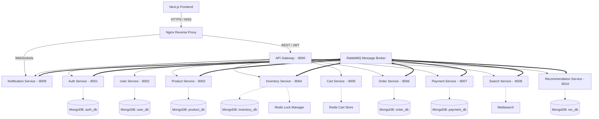

# Production-Grade E-Commerce Microservices Platform

Welcome to the E-Commerce Microservices Platform. This repository serves as a comprehensive, production-ready portfolio project showcasing senior full-stack engineering skills. It implements a fully decoupled, event-driven microservices architecture using Node.js, Express, TypeScript, Next.js, RabbitMQ, Redis, MongoDB, and Meilisearch.

## 🚀 Key Features

- **Microservices Architecture:** 10 independent microservices + 1 API Gateway.
- **Event-Driven:** Asynchronous communication via RabbitMQ (`ecommerce_events` exchange).
- **Frontend:** Premium Next.js 15 App Router UI with Tailwind CSS, React Query, and Zustand.
- **Real-Time:** WebSockets via Socket.IO for live order tracking and notifications.
- **Security:** JWT Authentication (Access + Refresh tokens with rotation), RBAC (Customer, Vendor, Admin), Helmet, Rate Limiting.
- **Data Isolation:** Each service owns its MongoDB database.
- **Caching & Locking:** Redis for high-speed cart operations and distributed Redlock for inventory reservations.
- **Search:** Full-text search and autocomplete powered by Meilisearch.
- **DevOps:** Fully dockerized with `docker-compose`, GitHub Actions CI/CD pipeline, Nginx Reverse Proxy.
- **Observability:** Winston structured logging, Prometheus metrics scraping, and Grafana dashboards.
- **Recommendation Engine:** Python FastAPI service ready for AI/ML integration.

---

## 🏗 System Architecture Diagram



---

## 📁 Folder Structure

```text
.
├── .github/workflows/      # CI/CD GitHub Actions pipelines
├── gateway/                # Express API Gateway (Rate limiting, Proxy, Auth extraction)
├── services/               # Microservices Monorepo
│   ├── auth/               # Authentication, JWT, Roles
│   ├── user/               # User profiles, addresses
│   ├── product/            # Products, categories, reviews
│   ├── inventory/          # Stock tracking, Redis Redlock for reservations
│   ├── cart/               # Redis-based shopping cart
│   ├── order/              # Order lifecycle management
│   ├── payment/            # Stripe integration, transactions
│   ├── search/             # Meilisearch syncing and queries
│   ├── notification/       # Socket.io and Nodemailer
│   ├── recommendation/     # Python FastAPI Collaborative filtering
│   └── common/             # @ecom/common shared npm library (errors, events, middlewares)
├── frontend/               # Next.js 15, Tailwind, React Query, Zustand
├── docker-compose.yml      # Local orchestration
├── nginx.conf              # Reverse proxy ingress
├── prometheus.yml          # Metrics scraping config
└── package.json            # Root workspace config
```

---

## 🗄️ Database Schemas

Due to the microservice pattern, each service has an isolated database domain:

- **Auth Service (`auth_db`)**: `User` (email, hashed_password, role, isVerified, refreshTokens)
- **User Service (`user_db`)**: `Profile` (userId, firstName, lastName, phone), `Address` (street, city, default)
- **Product Service (`product_db`)**: `Product` (name, price, stock, images, category, variants), `Category`, `Review`
- **Inventory Service (`inventory_db`)**: `InventoryItem` (productId, totalStock, reservedStock), `StockMovement`
- **Order Service (`order_db`)**: `Order` (items, totalAmount, shippingAddress, paymentStatus, orderStatus)
- **Payment Service (`payment_db`)**: `Transaction` (orderId, paymentIntentId, amount, status)
- **Search Service (Meilisearch)**: `products` index
- **Cart Service (Redis)**: `cart:{userId}` key-value store

---

## 🔄 Microservice Communication Flow (Event-Driven)

We use **RabbitMQ** with a Topic Exchange (`ecommerce_events`) for asynchronous communication to prevent tight coupling.

**Example Flow: Placing an Order**
1. **Client** calls `POST /api/orders` on **API Gateway**.
2. **API Gateway** proxies to **Order Service**.
3. **Order Service** validates data, creates a PENDING order, and publishes `ORDER_CREATED`.
4. **Inventory Service** listens to `ORDER_CREATED`, acquires a Redis lock, and reserves stock.
5. **Notification Service** listens to `ORDER_CREATED` and sends an "Order Placed" email/socket event.
6. **Client** calls **Payment Service** to confirm Stripe payment.
7. **Payment Service** publishes `PAYMENT_COMPLETED`.
8. **Order Service** listens to `PAYMENT_COMPLETED`, updates status to PAID.
9. **Inventory Service** listens to `PAYMENT_COMPLETED`, deducts stock permanently and releases reservation.

---

## 🐳 Docker Setup & Local Development

### Prerequisites
- Node.js >= 20.x
- Docker & Docker Compose
- Stripe Test API Keys (put in `.env.example`)

### Quick Start
1. **Install dependencies:**
   ```bash
   npm install
   ```
2. **Build the shared common library:**
   ```bash
   npm run build:common
   ```
3. **Start the infrastructure and services:**
   ```bash
   npm run docker:up
   ```
4. **Access the application:**
   - Frontend UI: `http://localhost:3000`
   - API Gateway: `http://localhost:8000/api/...`
   - RabbitMQ Management: `http://localhost:15672`
   - Grafana Dashboards: `http://localhost:3001`

---

## 🌐 API Documentation

All REST APIs are exposed via the API Gateway (`http://localhost:8000/api`).

- **Auth**: `/api/auth/register`, `/api/auth/login`, `/api/auth/refresh-token`
- **Users**: `/api/users/profile`, `/api/users/addresses`
- **Products**: `/api/products` (GET, POST, PUT, DELETE)
- **Cart**: `/api/cart` (GET, POST items, DELETE items)
- **Orders**: `/api/orders` (POST create, GET history)
- **Payments**: `/api/payments/create-intent`, `/api/payments/webhook`
- **Search**: `/api/search/products?q=keyword`
- **Notifications**: `/api/notifications`

*Detailed Swagger/OpenAPI specs are available in the respective service directories.*

---

## 🚀 CI/CD Pipeline

Configured via **GitHub Actions** (`.github/workflows/ci-cd.yml`):
1. **Lint & Type Check:** Verifies TypeScript strictness and ESLint rules across the monorepo.
2. **Tests:** Spins up ephemeral Redis/MongoDB/RabbitMQ containers to run Jest integration tests.
3. **Docker Build:** Uses matrix strategy to build and push all 12 Docker images to GHCR concurrently.
4. **E2E Tests:** Runs Playwright against the fully orchestrated Docker Compose environment.
5. **Deploy:** Triggers staging/production server updates.

---

## 🛣️ Development Roadmap

- [x] Phase 1: Microservices Architecture & Shared Library Setup
- [x] Phase 2: Core Backend Services (Auth, User, Product, Order)
- [x] Phase 3: Infrastructure (Docker, RabbitMQ, Meilisearch, Redis)
- [x] Phase 4: Recommendation Service (Python FastAPI)
- [x] Phase 5: Next.js Frontend Foundation
- [ ] Phase 6: Admin Dashboard UI & Vendor Analytics
- [ ] Phase 7: Kubernetes Helm Charts for Production
- [ ] Phase 8: Mobile App (React Native)

---

## 🛡️ Production Deployment Guide

For production, we recommend deploying to a managed Kubernetes cluster (EKS/GKE).
1. Apply the ConfigMaps and Secrets for environment variables.
2. Deploy managed databases (MongoDB Atlas, AWS ElastiCache, Amazon MQ).
3. Update the `nginx.conf` or use an Ingress Controller with cert-manager for SSL termination.
4. Scale stateless services (`product-service`, `gateway`, `frontend`) based on CPU utilization metrics fetched from Prometheus.

---
*Developed as a demonstration of Senior Full-Stack Engineering principles.*
