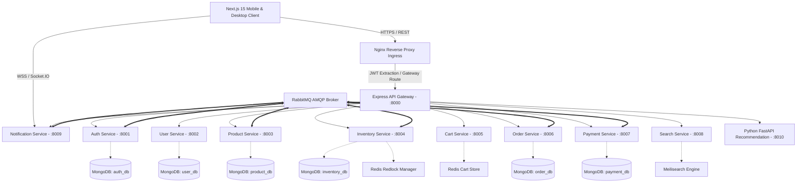

# Nati. — Enterprise Multi-Vendor E-Commerce Platform

> **A high-performance, event-driven e-commerce platform engineered for sub-second latency, zero-downtime scalability, and responsive real-time user experiences.**

[](https://nextjs.org/)
[](https://react.dev/)
[](https://www.typescriptlang.org/)
[](https://tailwindcss.com/)
[](https://nodejs.org/)
[](https://www.mongodb.com/)
[](https://redis.io/)
[](https://www.rabbitmq.com/)
[](https://www.docker.com/)
[](LICENSE)

---

## 🎯 Executive Summary & Problem Statement

Legacy e-commerce monoliths frequently suffer from single points of failure, slow database lock contention during flash sales, and inflexible UI layouts across varying mobile viewports. **Nati.** addresses these real-world engineering bottlenecks by combining a **distributed, event-driven microservices architecture** on the backend with a **mobile-first, highly responsive Next.js 15 App Router** on the frontend.

### The Problem
- **Database Lock Contention**: High-concurrency checkout spikes cause race conditions and over-selling in traditional databases.
- **Tight Coupling**: Monolithic architectures slow down deployment velocity and force full platform redeployments for minor updates.
- **Subpar Mobile UX**: Heavy client bundles and rigid pixel widths lead to layout breaks on smaller devices (320px–480px) and poor mobile conversion rates.

### The Solution
- **Distributed Concurrency Lock**: Integrated **Redis Redlock** to handle atomic inventory reservations with instant rollback capabilities during peak sales events.
- **Asynchronous Event-Driven Architecture**: Decoupled 10 microservices using **RabbitMQ AMQP Topic Exchanges**, enabling independent service autoscaling and eventual consistency.
- **Production-Grade Next.js Storefront**: Designed a fluid, mobile-first design system (**320px to 1440px+**) backed by **Zustand** state persistence, **React Query** caching, and **Socket.IO** real-time inventory telemetry.

---

## 🌟 Key Features

### 🛍️ Customer Storefront & Shopping Experience
- **Fluid Multi-Device UI**: Fully responsive across mobile (320px–480px), tablet (481px–1024px), and desktop (1025px+) with zero horizontal overflow.
- **Instant Product Search & Discovery**: Multi-faceted product filtering (category, brand, price range, stock availability) with quick-view modal overlays.
- **Dynamic Variant Matrix**: Interactive color, size, and storage capacity selectors with real-time price offsets and thumbnail switching.
- **Persistent Cart & Wishlist**: Real-time badge indicators, dynamic subtotal calculations, and Zustand local storage persistence.
- **Multi-Step Checkout & Payments**: Multi-tier shipping rules, discount coupon engine, and seamless **Stripe API** Integration with automated webhook confirmation.

### 📊 Super Admin Control Center (`/admin`)
- **Live Telemetry Dashboard**: Real-time monitoring of Gross Merchandise Value (GMV), active customer growth, and database connectivity.
- **System Health Mesh**: Direct status telemetry for MongoDB, Redis, RabbitMQ, and active API microservices.
- **Moderation Queues**: Vendor onboarding verification and product catalog approval workflow.
- **Security & Audit Logs**: Immutable system activity logging and role-based access controls (RBAC).

### 🏪 Seller Vendor Portal (`/vendor`)
- **Catalog & Inventory Management**: Add/edit product lines with custom variant options and real-time stock adjustments.
- **Fulfillment Operations**: Order status updates, customer communication channels, and payout tracking tables.

---

## 📸 Screenshots & Demos

| Desktop Storefront | Mobile Responsive Viewport |
| :---: | :---: |
|  |  |

| Super Admin Telemetry Dashboard | Seller Vendor Inventory Management |
| :---: | :---: |
|  |  |

---

## 🛠️ Technology Stack

| Category | Technologies |
| :--- | :--- |
| **Frontend Framework** | Next.js 15 (App Router, React 19, Server & Client Components) |
| **Language & Types** | TypeScript 5.0 (Strict mode enabled) |
| **Styling & Design System** | Tailwind CSS v3.4, Vanilla CSS Tokens, Glassmorphism, Responsive Breakpoints |
| **State Management** | Zustand (with LocalStorage persist middleware) |
| **Data Fetching & Caching** | React Query (TanStack Query v5), Axios |
| **Animations & Icons** | Framer Motion, Lucide React Icons |
| **Backend Services** | Node.js v20+, Express.js, Microservices Monorepo (`@ecom/common`) |
| **Database Architecture** | MongoDB 8.x (Isolated database per microservice pattern), Mongoose ORM |
| **Distributed Cache & Locking** | Redis (Redlock distributed lock algorithm & Cart session cache) |
| **Message Broker** | RabbitMQ (Topic Exchange `ecommerce_events`) |
| **Real-Time Communication** | Socket.IO (WebSockets with automatic polling fallback) |
| **Payment Gateway** | Stripe API (PaymentIntents, Webhook handling) |
| **DevOps & Tooling** | Docker, Docker Compose, Nginx Ingress Proxy, Meilisearch, Playwright E2E |

---

## 🏗️ System Architecture & Data Flow


```mermaid
graph TD
    Client[Next.js 15 Mobile & Desktop Client] -->|HTTPS / REST| Nginx[Nginx Reverse Proxy Ingress]
    Client -->|WSS / Socket.IO| NotificationService
    
    Nginx -->|JWT Extraction / Gateway Route| Gateway[Express API Gateway - :8000]
    
    %% Microservices Routing
    Gateway --> AuthService[Auth Service - :8001]
    Gateway --> UserService[User Service - :8002]
    Gateway --> ProductService[Product Service - :8003]
    Gateway --> InventoryService[Inventory Service - :8004]
    Gateway --> CartService[Cart Service - :8005]
    Gateway --> OrderService[Order Service - :8006]
    Gateway --> PaymentService[Payment Service - :8007]
    Gateway --> SearchService[Search Service - :8008]
    Gateway --> NotificationService[Notification Service - :8009]
    Gateway --> RecService[Python FastAPI Recommendation - :8010]
    
    %% Datastores
    AuthService -.-> AuthDB[(MongoDB: auth_db)]
    UserService -.-> UserDB[(MongoDB: user_db)]
    ProductService -.-> ProductDB[(MongoDB: product_db)]
    InventoryService -.-> InvDB[(MongoDB: inventory_db)]
    InventoryService -.-> RedisLock[Redis Redlock Manager]
    CartService -.-> RedisCart[Redis Cart Store]
    OrderService -.-> OrderDB[(MongoDB: order_db)]
    PaymentService -.-> PayDB[(MongoDB: payment_db)]
    SearchService -.-> Meili[Meilisearch Engine]
    
    %% Event Bus
    RabbitMQ[RabbitMQ AMQP Broker] <==> AuthService
    RabbitMQ <==> ProductService
    RabbitMQ <==> InventoryService
    RabbitMQ <==> OrderService
    RabbitMQ <==> PaymentService
    RabbitMQ <==> NotificationService
```

---

## ⚡ Quick Start & Installation

### Prerequisites
- **Node.js**: `>= 20.0.0`
- **npm**: `>= 10.0.0`
- **Docker & Docker Compose** *(optional for containerized setup)*
- **MongoDB** & **Redis** running locally or cloud-hosted instances

### 1. Clone the Repository
```bash
git clone https://github.com/Nati1-2/Ecommerce.git
cd Ecommerce
```

### 2. Frontend Setup (Next.js 15)
```bash
# Navigate to frontend directory
cd frontend

# Install dependencies
npm install

# Run local development server
npm run dev
```
Open `http://localhost:3000` in your browser.

### 3. Microservices Backend Setup (Monorepo)
```bash
# From repository root
npm install

# Build shared npm package
npm run build:common

# Start development services via Docker Compose
npm run docker:up
```

---

## ⚙️ Environment Variables

### Frontend Environment (`frontend/.env.local`)
```env
NEXT_PUBLIC_API_URL=http://localhost:8000/api
NEXT_PUBLIC_SOCKET_URL=http://localhost:8009
NEXT_PUBLIC_STRIPE_PUBLISHABLE_KEY=pk_test_sample_key_here
```

### Backend Environment Example (`.env.example`)
```env
PORT=8000
NODE_ENV=development
JWT_SECRET=your_super_secret_jwt_key
REFRESH_TOKEN_SECRET=your_super_secret_refresh_key
MONGO_URI=mongodb://localhost:27017/ecom_db
REDIS_HOST=127.0.0.1
REDIS_PORT=6379
RABBITMQ_URL=amqp://localhost:5672
STRIPE_SECRET_KEY=sk_test_sample_key_here
STRIPE_WEBHOOK_SECRET=whsec_sample_key_here
```

---

## 💡 Engineering Challenges & Solutions

### 1. Atomic Inventory Reservations During Concurrency Spikes
- **Challenge**: Simultaneous user purchases on low-stock items created classic race conditions, allowing stock counts to drop below zero.
- **Solution**: Implemented **Redis Redlock distributed locking** inside `InventoryService`. When a checkout is initiated, an ephemeral lock (with a 5-second TTL) is acquired before updating MongoDB stock schemas. If payment fails or times out, the stock reservation automatically releases.

### 2. Zero-Layout-Shift Mobile Responsiveness (320px–1440px)
- **Challenge**: Standard e-commerce templates clip content on small 320px devices (e.g., iPhone SE 1st Gen) and stretch single columns awkwardly on portrait 768px tablets.
- **Solution**: Engineered a mobile-first Tailwind design system using dynamic container padding (`px-3 min-[400px]:px-4 sm:px-6`), responsive table horizontal scroll wrappers (`min-w-[650px] overflow-x-auto`), and responsive grid column steps (`grid-cols-1 min-[360px]:grid-cols-2 sm:grid-cols-2 lg:grid-cols-4`).

### 3. Data Consistency Across Microservices (Saga Pattern)
- **Challenge**: Maintaining state synchronization between Order, Payment, and Inventory services without distributed transaction overhead.
- **Solution**: Implemented asynchronous event publishing via **RabbitMQ**. When an order is placed, an `ORDER_CREATED` event triggers stock reservation. Upon successful Stripe webhook validation, a `PAYMENT_COMPLETED` event permanently deducts stock and notifies the customer via WebSockets.

---

## 🔒 Security & Performance Considerations

- **Strict Type Safety**: Full TypeScript strict mode compliance across frontend models, stores, and API clients.
- **Authentication & RBAC**: Stateless JWT verification with automatic token rotation, HTTP-only cookie support, and route middleware checks (`CUSTOMER`, `VENDOR`, `ADMIN`).
- **Responsive Touch Targets**: Enforced 44px minimum touch targets and tap highlight removal for iOS/Android viewports.
- **Optimized Bundle Sizes**: Next.js 15 dynamic imports (`next/dynamic`) for heavy chart components (`Recharts`), keeping initial JS payload size low.

---

## 📁 Repository Folder Structure

```text
Ecomerce/
├── frontend/                   # Next.js 15 App Router Frontend
│   ├── src/
│   │   ├── app/                # App router pages (Home, Products, Checkout, Admin, Vendor, Login)
│   │   ├── components/         # Modular React UI components
│   │   │   ├── AdminDashboard/ # Telemetry, health monitors, revenue charts
│   │   │   ├── Checkout/       # Multi-step checkout & payment forms
│   │   │   ├── ProductListing/ # Product grids, filters, quick-view modal
│   │   │   ├── ProductDetails/ # Gallery, variant selector, review section
│   │   │   ├── Dashboard/      # User account management panels
│   │   │   ├── layout/         # Navbar, BottomNav, Footer, LayoutShell
│   │   │   └── ui/             # Reusable UI primitives & toasts
│   │   ├── hooks/              # Custom React Query & Socket.IO hooks
│   │   ├── services/           # Axios API services & Stripe helpers
│   │   ├── store/              # Zustand state stores (Cart, Wishlist, Auth, Profile)
│   │   └── types/              # Global TypeScript interfaces
│   ├── public/                 # Static assets & product images
│   ├── tailwind.config.ts      # Design system & color tokens
│   └── tsconfig.json           # TypeScript configuration
├── backend/                    # Core API endpoints & Node.js services
├── services/                   # Microservices monorepo (Auth, Product, Order, Inventory, Cart)
├── docker-compose.yml          # Container orchestration configuration
└── README.md                   # Project documentation
```

---

## 🛣️ Product & Engineering Roadmap

- [x] **Phase 1**: Decoupled Monorepo Architecture & Shared Library Setup
- [x] **Phase 2**: Core Microservices (Auth, User, Product, Inventory, Order, Payment)
- [x] **Phase 3**: Next.js 15 Storefront & Mobile Responsiveness Overhaul (320px–1440px)
- [x] **Phase 4**: Super Admin Control Center & Real-Time Telemetry
- [ ] **Phase 5**: Native React Native / Expo Mobile Application
- [ ] **Phase 6**: Helm Charts & Managed Kubernetes (EKS / GKE) Deployment Pipelines
- [ ] **Phase 7**: AI Collaborative Filtering Product Recommendation Engine

---

## 🤝 Contributing

Contributions are welcome! Please follow these steps:
1. Fork the repository (`https://github.com/Nati1-2/Ecommerce/fork`)
2. Create your feature branch (`git checkout -b feature/AmazingFeature`)
3. Commit your changes (`git commit -m 'feat: add amazing feature'`)
4. Push to the branch (`git push origin feature/AmazingFeature`)
5. Open a Pull Request

---

## 📜 License

Distributed under the MIT License. See [`LICENSE`](LICENSE) for more information.

---

## 👤 Author & Contact

**Nati**  
*Senior Full-Stack Engineer*

- **GitHub**: [github.com/Nati1-2](https://github.com/Nati1-2)
- **Project Repository**: [github.com/Nati1-2/Ecommerce](https://github.com/Nati1-2/Ecommerce)
- **LinkedIn**: [linkedin.com/in/your-linkedin-profile](#)
- **Email**: [contact@nati.shop](mailto:contact@nati.shop)
