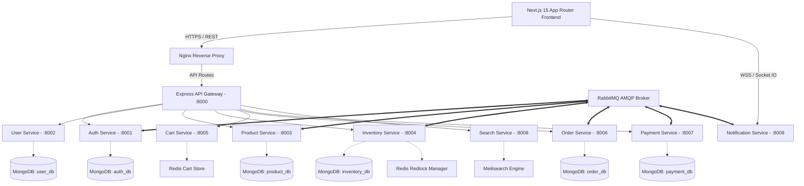

# Nati. — Enterprise Multi-Vendor E-Commerce Platform

> **A high-performance, event-driven e-commerce platform engineered for sub-second latency, zero-downtime scalability, and responsive real-time user experiences.**

[](https://nextjs.org/)
[](https://react.dev/)
[](https://www.typescriptlang.org/)
[](https://tailwindcss.com/)
[](https://nodejs.org/)
[](https://www.mongodb.com/)
[](https://redis.io/)
[](https://www.rabbitmq.com/)
[](https://www.docker.com/)
[](LICENSE)

---

## Overview

### What the Project Does
**Nati.** is an end-to-end, multi-vendor e-commerce platform designed to seamlessly connect customers, independent sellers, and platform administrators. It provides a complete online shopping ecosystem including full-text product search, dynamic variant selection, persistent cart/wishlist management, multi-step checkout with Stripe, real-time inventory tracking, seller vendor management, and a live Super Admin telemetry control center.

### Why It Was Built
Traditional e-commerce platforms often encounter major technical limitations during high-concurrency traffic bursts (such as flash sales), including race conditions that lead to negative stock balances, high database lock contention, slow client bundle loading, and horizontal layout degradation on mobile devices. **Nati.** was engineered from the ground up as a production-grade portfolio project to demonstrate senior software engineering expertise in building event-driven microservices, distributed concurrency control, and mobile-first frontend architectures.

### What Problem It Solves
1. **Flash Sale Concurrency & Race Conditions**: Solves inventory overselling during concurrent checkouts via distributed Redis Redlock locks.
2. **System Coupling & Scalability Limits**: Replaces monolithic bottlenecks with 10 independent microservices communicating asynchronously over RabbitMQ AMQP message queues.
3. **Mobile User Conversion Drop-Off**: Eliminates layout breaks, heavy bundle bloat, and text clipping across 320px–1440px viewports using Next.js 15 App Router dynamic imports and Tailwind CSS design tokens.

---

## Features

### 🛍️ Customer Storefront Experience
- **Mobile-First Responsive Layout**: Built to adapt flawlessly across **320px–480px** (Mobile), **481px–1024px** (Tablet), and **1025px+** (Desktop) without horizontal scrollbar overflow.
- **Dynamic Variant Matrix**: Real-time price delta calculations and gallery updates based on selected product color, storage, or size options.
- **Instant Product Search & Filtering**: Client-side and server-assisted multi-category filtering by price range, brand, stock level, and user ratings.
- **Persistent Cart & Wishlist**: Zustand-powered local persistence with instant badge count updates and auto-calculated subtotals.
- **Multi-Step Checkout & Stripe Payments**: Complete checkout workflow featuring address verification, shipping tier selection, coupon code engine, and Stripe Payment Intent processing.

### 📊 Super Admin Control Center (`/admin`)
- **Live Platform Telemetry**: Real-time Gross Merchandise Value (GMV), active user growth metrics, and live transaction counters.
- **System Health Monitor**: Direct connectivity metrics for MongoDB, Redis caches, RabbitMQ queues, and microservice APIs.
- **Moderation Queues**: Dedicated workflows for verifying seller vendor applications and approving incoming product catalog submissions.
- **Audit Logs & Security**: Immutable activity tracking logs and fine-grained role-based access control (RBAC).

### 🏪 Seller Vendor Portal (`/vendor`)
- **Inventory & Variant Manager**: Add, update, and manage product lines with multi-variant stock levels and custom SKU pricing.
- **Fulfillment & Payout Logs**: Track customer orders, manage shipment statuses, and view payout summary metrics.

---

## Screenshots / Demo

- **GitHub Source Code Repository**: [https://github.com/Nati1-2/Ecommerce](https://github.com/Nati1-2/Ecommerce)

| Desktop Storefront View | Mobile 320px Responsive View |
| :---: | :---: |
|  |  |

| Super Admin Telemetry Control Center | Seller Vendor Inventory Management |
| :---: | :---: |
|  |  |

---

## Tech Stack

### Frontend
- **Framework**: Next.js 15.5 (App Router, Server Components & Client Components), React 19
- **Language**: TypeScript 5.0 (Strict mode)
- **Styling**: Tailwind CSS v3.4, Vanilla CSS Design Tokens, Glassmorphic UI overlays
- **State Management**: Zustand (Persisted stores for Cart, Wishlist, Auth, Profile)
- **Data Fetching**: React Query (TanStack Query v5), Axios
- **Animations & Icons**: Framer Motion, Lucide React Icons
- **Charts & Data Viz**: Recharts

### Backend
- **Runtime & Framework**: Node.js v20.x, Express.js
- **Microservices Monorepo**: Decoupled domain services connected via shared `@ecom/common` package
- **Real-Time Communication**: Socket.IO WebSockets (with polling fallback)
- **Authentication**: JWT (Access & Refresh tokens), bcryptjs password hashing

### Database & Messaging
- **Primary Database**: MongoDB 8.x (Isolated database per service pattern: `auth_db`, `product_db`, `order_db`, etc.)
- **Caching & Locks**: Redis (Redlock distributed locking algorithm & Session store)
- **Message Broker**: RabbitMQ (AMQP Topic Exchange `ecommerce_events`)
- **Search Engine**: Meilisearch

### Tools & Infrastructure
- **Containerization**: Docker, Docker Compose
- **Web Server & Ingress**: Nginx Reverse Proxy
- **E2E Testing**: Playwright
- **CI/CD**: GitHub Actions workflows

---

## Architecture

The project implements a decoupled, event-driven microservices architecture communicating via asynchronous RabbitMQ message queues and REST API endpoints.


```mermaid
graph TD
    Client[Next.js 15 App Router Frontend] -->|HTTPS / REST| Nginx[Nginx Reverse Proxy]
    Client -->|WSS / Socket.IO| NotificationService[Notification Service - :8009]
    
    Nginx -->|API Routes| Gateway[Express API Gateway - :8000]
    
    %% Gateway Proxies
    Gateway --> AuthService[Auth Service - :8001]
    Gateway --> UserService[User Service - :8002]
    Gateway --> ProductService[Product Service - :8003]
    Gateway --> InventoryService[Inventory Service - :8004]
    Gateway --> CartService[Cart Service - :8005]
    Gateway --> OrderService[Order Service - :8006]
    Gateway --> PaymentService[Payment Service - :8007]
    Gateway --> SearchService[Search Service - :8008]
    
    %% Databases
    AuthService -.-> AuthDB[(MongoDB: auth_db)]
    UserService -.-> UserDB[(MongoDB: user_db)]
    ProductService -.-> ProductDB[(MongoDB: product_db)]
    InventoryService -.-> InvDB[(MongoDB: inventory_db)]
    InventoryService -.-> RedisLock[Redis Redlock Manager]
    CartService -.-> RedisCart[Redis Cart Store]
    OrderService -.-> OrderDB[(MongoDB: order_db)]
    PaymentService -.-> PayDB[(MongoDB: payment_db)]
    SearchService -.-> Meili[Meilisearch Engine]
    
    %% Message Broker
    RabbitMQ[RabbitMQ AMQP Broker] <==> AuthService
    RabbitMQ <==> ProductService
    RabbitMQ <==> InventoryService
    RabbitMQ <==> OrderService
    RabbitMQ <==> PaymentService
    RabbitMQ <==> NotificationService
```

---

## Installation

### Prerequisites
Make sure you have the following installed on your machine:
- **Node.js**: `>= 20.0.0`
- **npm**: `>= 10.0.0`
- **Docker & Docker Compose**: *(optional for local container orchestration)*
- **MongoDB** & **Redis**: *(running locally or via cloud services)*

### Step-by-Step Setup

1. **Clone the repository**:
   ```bash
   git clone https://github.com/Nati1-2/Ecommerce.git
   cd Ecommerce
   ```

2. **Setup and run the Next.js Frontend**:
   ```bash
   cd frontend
   npm install
   npm run dev
   ```
   The frontend will be available at `http://localhost:3000`.

3. **Setup the Microservices Monorepo**:
   ```bash
   # From project root directory
   npm install
   npm run build:common
   ```

4. **Run using Docker Compose** *(Recommended)*:
   ```bash
   npm run docker:up
   ```

---

## Environment Variables

### Frontend Environment (`frontend/.env.local`)
```env
NEXT_PUBLIC_API_URL=http://localhost:8000/api
NEXT_PUBLIC_SOCKET_URL=http://localhost:8009
NEXT_PUBLIC_STRIPE_PUBLISHABLE_KEY=pk_test_sample_key_here
```

### Backend Environment Example (`.env.example`)
```env
PORT=8000
NODE_ENV=development
JWT_SECRET=your_super_secret_jwt_key
REFRESH_TOKEN_SECRET=your_super_secret_refresh_key
MONGO_URI=mongodb://localhost:27017/ecom_db
REDIS_HOST=127.0.0.1
REDIS_PORT=6379
RABBITMQ_URL=amqp://localhost:5672
STRIPE_SECRET_KEY=sk_test_sample_key_here
STRIPE_WEBHOOK_SECRET=whsec_sample_key_here
```

---

## Running the Project

### Development Mode
```bash
# Start frontend in development mode
cd frontend
npm run dev

# Run TypeScript type checker
npm run lint
```

### Production Mode
```bash
# Build frontend production bundle
cd frontend
npm run build

# Start production server
npm run start
```

---

## Project Structure

```text
Ecommerce/
├── frontend/                   # Next.js 15 App Router Frontend
│   ├── src/
│   │   ├── app/                # Page routes (Home, Products, Checkout, Admin, Vendor, Login)
│   │   ├── components/         # Reusable React components
│   │   │   ├── AdminDashboard/ # Telemetry dashboard, health mesh, revenue charts
│   │   │   ├── Checkout/       # Multi-step checkout & payment forms
│   │   │   ├── ProductListing/ # Product grids, filters, quick-view modal
│   │   │   ├── ProductDetails/ # Gallery, variant selector, reviews
│   │   │   ├── Dashboard/      # Customer profile & account panels
│   │   │   ├── layout/         # Navbar, BottomNav, Footer, LayoutShell
│   │   │   └── ui/             # Reusable UI primitives & toasts
│   │   ├── hooks/              # React Query & Socket.IO custom hooks
│   │   ├── services/           # Axios API services & Stripe helper clients
│   │   ├── store/              # Zustand state stores (Cart, Wishlist, Auth, Profile)
│   │   └── types/              # Global TypeScript interfaces
│   ├── public/                 # Static images & assets
│   ├── tailwind.config.ts      # Design tokens & breakpoint config
│   └── tsconfig.json           # TypeScript configuration
├── backend/                    # Core API Gateway & REST endpoints
├── services/                   # Microservices monorepo (Auth, Product, Order, Inventory, Cart)
├── docker-compose.yml          # Docker container orchestration setup
└── README.md                   # Project documentation
```

---

## API Documentation

All API requests pass through the centralized API Gateway at `http://localhost:8000/api`:

| Domain | Method | Endpoint | Description |
| :--- | :--- | :--- | :--- |
| **Auth** | `POST` | `/api/auth/register` | Create customer or seller vendor account |
| **Auth** | `POST` | `/api/auth/login` | Authenticate user and issue JWT tokens |
| **User** | `GET` | `/api/users/profile` | Retrieve active user profile data |
| **Products**| `GET` | `/api/products` | Query products with category, brand, and search filters |
| **Products**| `GET` | `/api/products/:id` | Retrieve single product details & variant data |
| **Cart** | `GET` | `/api/cart` | Get current user cart state |
| **Orders** | `POST` | `/api/orders` | Create pending order & acquire inventory locks |
| **Payments**| `POST` | `/api/payments/create-intent` | Initialize Stripe PaymentIntent |

---

## Challenges & Solutions

### 1. High Concurrency Race Conditions During Checkout
- **Problem**: Simultaneous checkouts on low-stock products allowed inventory counts to fall below zero.
- **Solution**: Implemented **Redis Redlock distributed locking** in `InventoryService`. When checkout starts, a lock with a 5-second TTL is acquired before modifying MongoDB stock counts, releasing automatically if payment fails.

### 2. Zero-Layout-Shift Mobile Responsiveness (320px–1440px)
- **Problem**: Standard e-commerce layouts break or clip text on narrow 320px mobile screens (e.g., iPhone SE) and stretch awkward single columns on portrait 768px tablets.
- **Solution**: Built a mobile-first design system utilizing fluid padding (`px-3 min-[400px]:px-4 sm:px-6`), responsive horizontal scroll wrappers (`min-w-[650px] overflow-x-auto`) for data tables, and adaptive breakpoint steps (`grid-cols-1 min-[360px]:grid-cols-2 sm:grid-cols-2 lg:grid-cols-4`).

### 3. Asynchronous Saga Pattern for Microservices
- **Problem**: Keeping Order, Inventory, and Payment services synchronized without synchronous API chaining overhead.
- **Solution**: Used **RabbitMQ Topic Exchanges** (`ecommerce_events`). Orders emit `ORDER_CREATED`, triggering inventory locks. Upon Stripe webhook confirmation, a `PAYMENT_COMPLETED` event finalizes stock deduction and notifies the user via WebSockets.

---

## Security & Performance

- **Stateless JWT Authorization**: Secure access and refresh token workflow with role checks (`CUSTOMER`, `VENDOR`, `ADMIN`).
- **Strict TypeScript Compliance**: Type safety across all models, stores, and API layers to prevent runtime errors.
- **Dynamic Imports & Code Splitting**: Utilized `next/dynamic` for heavy chart libraries (`Recharts`), keeping initial bundle size minimal.
- **Mobile Touch Optimization**: Minimum 44px touch targets and tap highlight removal for iOS/Android viewports.

---

## Future Improvements

- [ ] **Native Mobile Application**: Build a cross-platform React Native / Expo application.
- [ ] **Kubernetes Deployment**: Create Helm charts for automated EKS / GKE orchestration.
- [ ] **AI Recommendation Engine**: Deploy a Python FastAPI collaborative filtering service for personalized product recommendations.

---

## Contributing

Contributions are welcome! Follow these steps:
1. Fork the repository (`https://github.com/Nati1-2/Ecommerce/fork`)
2. Create your feature branch (`git checkout -b feature/AmazingFeature`)
3. Commit your changes (`git commit -m 'feat: add amazing feature'`)
4. Push to the branch (`git push origin feature/AmazingFeature`)
5. Open a Pull Request

---

## License

This project is licensed under the MIT License - see the [`LICENSE`](LICENSE) file for details.

---

## Author

**Nati**  
*Senior Full-Stack Engineer*

- **GitHub**: [github.com/Nati1-2](https://github.com/Nati1-2)
- **Repository**: [github.com/Nati1-2/Ecommerce](https://github.com/Nati1-2/Ecommerce)
- **Email**: [natnaelman368@gmail.com](mailto:natnaelman368@gmail.com)
