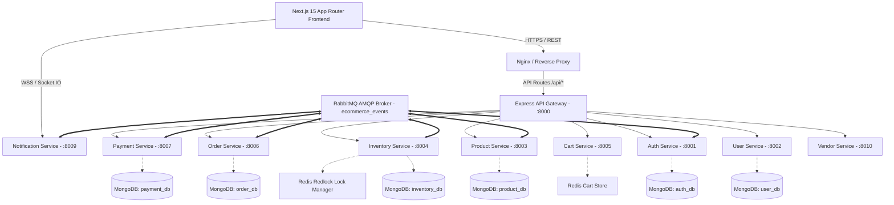

# 🏗️ System Architecture & Technology Topology — Nati E-Commerce Platform

This document describes the target architectural design, layer boundaries, microservices topology, data flow, and infrastructure components of the **Nati.** E-Commerce Platform.

---

## 📐 Overall System Topology

The platform is designed as a hybrid microservices monorepo system. The Next.js 15 App Router frontend communicates with an Express API Gateway, which proxies requests to specialized domain microservices.

---

## 🧩 Architectural Layers

### 1. Presentation Layer (`frontend/`)
- **Framework**: Next.js 15 (React 19) App Router.
- **Styling**: Vanilla CSS design tokens & Tailwind CSS v3.4 utilities.
- **State Management**:
  - **Server State**: TanStack React Query v5 (caching, invalidation, optimistic updates).
  - **Client Store State**: Zustand (persisted cart, wishlist, auth token state, profile, UI flags).
- **Asset Optimization**: `next/dynamic` code splitting for heavy data visualization libraries (Recharts).

### 2. API Gateway & Ingress Layer (`backend/api-gateway/`)
- **Gateway Runtime**: Express.js proxying requests via `express-http-proxy`.
- **Cross-Cutting Concerns**:
  - Centralized rate limiting (`express-rate-limit`).
  - Security headers (`helmet`).
  - CORS origin verification.
  - JWT statutory verification and user context injection (`x-user-id`, `x-user-role`).

### 3. Domain Microservices Layer (`backend/services/*`)
Each microservice is a standalone Express application enforcing strict domain isolation:
- `auth-service` (Port 8001): Account registration, authentication, JWT token issuance & rotation, password hashing.
- `user-service` (Port 8002): Customer profile management, shipping address books, avatar uploads.
- `product-service` (Port 8003): Catalog management, multi-facet filtering, variant matrix definitions.
- `inventory-service` (Port 8004): Stock tracking, distributed Redis Redlock concurrency locking.
- `cart-service` (Port 8005): Redis-backed session cart management with fast read/write operations.
- `order-service` (Port 8006): Order generation, transaction state transitions, outbox event generation.
- `payment-service` (Port 8007): Stripe PaymentIntent initialization, webhook signature validation, idempotency via `PaymentEvent`.
- `notification-service` (Port 8009): Socket.IO WebSockets & transactional email dispatch (Nodemailer).
- `vendor-service` (Port 8010): Seller store onboarding, store metrics, vendor order fulfillment.
- `analytics-service` (Port 8011): Admin platform GMV telemetry and audit log aggregations.

### 4. Shared Utilities & Contracts (`backend/shared/`)
- Package name: `@ecom/shared`
- Contains common error classes (`BadRequestError`, `NotFoundError`, `UnauthorizedError`), common Express middleware (`currentUser`, `requireAuth`, `errorHandler`), and AMQP event payload interfaces.

---

## 🔒 Concurrency & Distributed Event Architecture

### 1. Redis Redlock Distributed Locking
To prevent inventory overselling during concurrent checkout spikes:
1. When a checkout starts, `InventoryService` acquires a Redis Redlock key `lock:inventory:{productId}` with a 5-second TTL.
2. Stock is reserved atomically in MongoDB.
3. If lock acquisition fails, the user immediately receives a clear `409 Conflict` stock unavailable message.

### 2. Transactional Outbox & Event-Driven Messaging
To guarantee eventual consistency without synchronous microservice coupling:
1. Domain state updates write a message to an `Outbox` collection in the same database transaction.
2. An Outbox worker reads unpublished messages and emits them to the RabbitMQ AMQP exchange (`ecommerce_events`).
3. Subscribed microservices (e.g. `notification-service`, `analytics-service`) process events asynchronously.

---

## 🛠️ Known Limitations & Evolution Path
- **Monorepo Dev Server Setup**: Local development supports single-service startup (`npm run dev:auth`) or combined script (`npm run dev:backend`).
- **Serverless API Fallbacks**: Next.js `/api/*` route handlers exist for Vercel edge deployment when dedicated microservices are not spun up.
